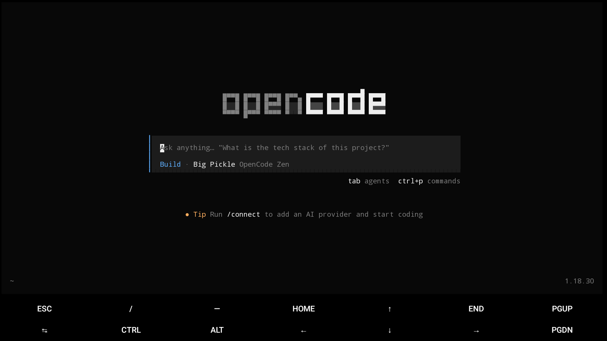

# Opencode Mobile Compatible

Run **OpenCode 1.18.30** (AI coding agent) inside **Termux** on an **x86_64 Android
emulator** (MuMuPlayer) — total footprint **~282 MB** (under a 500 MB cap).



> **Real ARM phones:** use the native [`guysoft/opencode-termux`](https://github.com/guysoft/opencode-termux)
> build instead — one-line install, no proot needed.
> This repo solves the rare **x86_64 + Termux** case, for which no community
> assets exist, using `proot` + Alpine + the official
> `opencode-linux-x64-baseline-musl` build.

---

## 1. Project understanding

**Goal:** a fully functional OpenCode terminal agent on a mobile-class Android
environment (Termux), fitting in 500 MB, installed and operable without touching
the emulator screen (headless via ADB).

**Why a custom method was needed:**

| Option | Verdict |
|---|---|
| Official `curl opencode.ai/install` / `npm i -g opencode-ai` | Linux glibc x64/arm64 only — no Android/Bionic build, fails on Termux |
| `guysoft/opencode-termux` (native Bionic build) | **aarch64 only** — our Termux is x86_64 |
| `Hope2333/opencode-termux` (glibc wrapper) | **aarch64 only**, needs glibc stack |
| proot-distro + Debian + npm | Debian chroot + Node + 185 MB binary blows the 500 MB budget |
| **This repo: proot + Alpine + musl-baseline binary** | ✅ ~282 MB total, verified working (TUI, serve, web, network) |

**Result:** OpenCode TUI, `run`, `serve` (headless server on `127.0.0.1:4096`),
`web` UI (HTTP 200 verified), `ripgrep`-powered file search, and working
network (DNS + HTTPS) from the real app context.

---

## 2. Installation

### 2.1 Prerequisites (host)

- Windows + MuMuPlayer installed and running (emulator shows as `emulator-5554`)
- ADB binary shipped with MuMu:
  `D:\Program Files\Netease\MuMuPlayer\nx_main\adb.exe`
- Termux **GitHub `github-debug` APK** (F-Droid/Play builds are not debuggable,
  and headless access needs `run-as com.termux`):
  `termux-app_v0.118.3+github-debug_x86_64.apk`

### 2.2 Install Termux on the emulator

```powershell
$adb = "D:\Program Files\Netease\MuMuPlayer\nx_main\adb.exe"
& $adb -s emulator-5554 install -r termux.apk
& $adb -s emulator-5554 shell "monkey -p com.termux -c android.intent.category.LAUNCHER 1"
# wait ~60s, then verify bootstrap finished:
& $adb -s emulator-5554 shell "run-as com.termux ls /data/data/com.termux/files/usr/bin/bash"
```

### 2.3 Download packages (on the host — guest network is restricted, see §5.5)

Termux x86_64 repo base: `https://packages-cf.termux.dev/apt/termux-main`

| File | URL / source | Size |
|---|---|---|
| `proot_5.1.107.92_x86_64.deb` | `pool/main/p/proot/` | 107 KB |
| `libtalloc_2.4.3_x86_64.deb` | `pool/main/libt/libtalloc/` | 33 KB |
| `libandroid-shmem_0.7_x86_64.deb` | `pool/main/liba/libandroid-shmem/` | 7 KB |
| `alpine-minirootfs-3.24.1-x86_64.tar.gz` | `https://dl-cdn.alpinelinux.org/alpine/latest-stable/releases/x86_64/` | 3.7 MB |
| `opencode-linux-x64-baseline-musl.tar.gz` | `https://github.com/sst/opencode/releases/download/v1.18.30/` | 63 MB |
| `ripgrep-15.2.0-x86_64-unknown-linux-musl.tar.gz` | `https://github.com/BurntSushi/ripgrep/releases/download/15.2.0/` | 2.2 MB |
| `libgcc-15.2.0-r5.apk`, `libstdc++-15.2.0-r5.apk` | `https://dl-cdn.alpinelinux.org/alpine/v3.24/main/x86_64/` | ~1 MB |

> **baseline** (not the default build): the emulator guest does not expose AVX2
> (`/proc/cpuinfo` shows none), so the AVX2 build would crash with illegal
> instruction. **musl** (not glibc): matches Alpine, no glibc stack needed.

### 2.4 Push + install (offline, via `run-as`)

```powershell
# stage through /data/local/tmp (run-as CANNOT read /sdcard, §5.6)
& $adb -s emulator-5554 push <file> /data/local/tmp/
```

Then run [`scripts/setup-termux.sh`](scripts/setup-termux.sh) inside Termux
(push it to `/data/local/tmp/` and execute
`run-as com.termux /data/data/com.termux/files/usr/bin/sh /data/local/tmp/setup-termux.sh`).
It does, offline:

1. `dpkg -i` the three proot `.deb`s
2. extracts Alpine to `~/alpine`
3. extracts `opencode` → `~/alpine/usr/local/bin/opencode`
4. extracts `rg` → `~/alpine/usr/local/bin/rg`
5. writes `~/alpine/etc/resolv.conf` (`10.0.2.3`, `168.63.129.16`)
6. installs [`scripts/install-libs.sh`](scripts/install-libs.sh) libs
   (`libgcc_s.so.1`, `libstdc++.so.6` — opencode segfaults without them)

Finish with:

```bash
mkdir -p ~/.termux && printf 'allow-external-apps=true\n' >> ~/.termux/termux.properties
# copy scripts/opencode-launcher.sh -> ~/opencode, scripts/alpine-shell.sh -> ~/alpine-sh
chmod 700 ~/opencode ~/alpine-sh
```

### 2.5 Verify

```bash
./opencode --version   # → 1.18.30
./opencode             # TUI (then /connect to add an AI provider key)
~/start-serve.sh       # headless server → http://127.0.0.1:4096, log ~/oc-serve.log
```

---

## 3. Working (architecture)

```
┌ Termux (Bionic, x86_64) ─────────────────────────────┐
│  ~/opencode  ──►  proot ──►  ~/alpine/ (Alpine,musl)  │
│                     │         ├─ usr/local/bin/opencode (musl-baseline, 186 MB)
│                     │         ├─ usr/local/bin/rg (musl, 5 MB)
│                     │         └─ usr/lib/libstdc++.so.6, libgcc_s.so.1
│                     ├─ binds: /dev /proc /sys,  ~/ → /home/host
│                     └─ unset LD_PRELOAD (else termux-exec breaks guest exec)
└──────────────────────────────────────────────────────┘
         ▲
 host: adb push → /data/local/tmp → run-as com.termux
       am RUN_COMMAND (background scripts, app context = full network)
```

- **No Node/Bun at runtime**: `bun build --compile` embeds the runtime in the
  single binary; only musl + C++ libs are needed.
- **Headless control** (no screen typing): Termux `RunCommandService`
  (`com.termux.RUN_COMMAND`, `BACKGROUND=true`) after setting
  `allow-external-apps=true` + app restart.
- **Storage** (`du -sh`, MiB): `$PREFIX` 79 (base 78 + proot ~1) + `$HOME` 203
  (`~/alpine`: opencode 186 + rg 5.2 + libs ~3 + rootfs ~8) = **~282 / 500**.

---

## 4. Uses

- Interactive AI coding inside Termux: `./opencode` (TUI), `/connect` for
  Anthropic/OpenAI keys, `tab` agents, `ctrl+p` commands.
- Non-interactive: `./opencode run "explain this repo"`.
- Headless HTTP: `opencode serve --port 4096` (+ `web` UI, verified HTTP 200).
- File search/edit via bundled musl `ripgrep`.
- Project files live in Termux `~/`, visible inside Alpine at `/home/host`.

---

## 5. Problems faced → fixes

| # | Problem | Root cause | Fix |
|---|---|---|---|
| 1 | `adb` not recognized; two adb servers fight (device `offline`) | MuMu ships its own adb; PATH adb missing/version clash | Use one binary everywhere: `MuMuPlayer\nx_main\adb.exe` |
| 2 | No official/community build runs | No Android build upstream; community builds are aarch64-only; Termux here is x86_64 | Custom stack: proot + Alpine + official `linux-x64-baseline-musl` |
| 3 | Risk of illegal-instruction crash | Guest `/proc/cpuinfo` has no AVX2 (AMD EPYC host) | Use the **baseline** variant |
| 4 | `opencode: libstdc++.so.6: No such file` | Bun-compiled binary dynamically links C++ stdlib; minirootfs lacks it | Extract Alpine `libgcc`+`libstdc++` `.apk`s into rootfs (`scripts/install-libs.sh`) |
| 5 | `apt update` fails in Termux (`Could not resolve host`) | `run-as` debugging context has no DNS/external TCP (SELinux), though shell UID resolves fine | **Host-assisted offline install**: download on host, `adb push`, offline `dpkg -i`/`tar` |
| 6 | `run-as cat /sdcard/...` → Permission denied | `run-as` has no `/sdcard` access by design | Stage via `/data/local/tmp` (world-readable, `run-as` can read) |
| 7 | Proot fails: `execve("/usr/bin/env"): No such file` + termux-exec hint | `LD_PRELOAD=libtermux-exec.so` rewrites guest paths | `unset LD_PRELOAD` before every `proot` call |
| 8 | Commands with `$PREFIX` arrive broken/empty | PowerShell interpolates `$...` before adb sees it | Never inline `$` vars — write **script files**, push, execute |
| 9 | Pushed `.sh` files would break on Termux | Windows git `core.autocrlf` → CRLF (`bad interpreter`) | `.gitattributes`: `*.sh text eol=lf` + `git add --renormalize` (verified `i/lf`) |
| 10 | Termux opens on wrong screen; screenshots show launcher | MuMu exposes 3 displays (`mumuscreen000/002/003`); Termux lands on secondary | Target it: `input -d <logical-id>`, `screencap -d <surfaceflinger-id>` (Termux found on `mumuscreen003`) |
| 11 | Typing does nothing in Termux window | No focused window (`FocusedWindows` empty); MuMu game-keymapping eats keys; IME "view is not served" | Tap terminal to focus; disable MuMu keymapping; `settings put secure show_ime_with_hard_keyboard 1` (only Sogou IME ships — use EN mode or install Gboard) |
| 12 | Is network really OK for API calls? | `run-as` network blocked, so headless tests lie | Verified from **app context** via `RUN_COMMAND`: Termux `curl api.github.com/zen` OK; inside Alpine: `nslookup` + HTTPS download OK |
| 13 | Secret handling | PAT must never land in files/history | Auth via in-memory `http.extraHeader` per command, `credential.helper=` cleared, no token in repo; rotate any exposed token |

---

## 6. Verified environment

- Host: Windows, MuMuPlayer (`MuMuNxMain`/`MuMuNxSVC`), `emulator-5554` / `127.0.0.1:7555`
- Guest: Android 15 (SM-A235F), Termux v0.118.3 `github-debug` x86_64
- OpenCode **1.18.30** — `--version`, `--help`, TUI on screen (see screenshot),
  `serve` on 4096 (log `listening…`, `/proc/net/tcp` LISTEN, HTTP 200)

---

## 7. Complete copy-paste commands (host PowerShell)

Run these in order on the Windows host. Replace `emulator-5554` with your
serial from `adb devices` if different. Assumes this repo is cloned and your
PowerShell is opened **inside the repo folder**.

```powershell
# 0. ADB (MuMu's own binary — use it for every command)
$adb = "D:\Program Files\Netease\MuMuPlayer\nx_main\adb.exe"
& $adb devices -l
```

```powershell
# 1. Termux APK (GitHub debug build = headless-able) + install + first launch
Invoke-WebRequest -Uri "https://github.com/termux/termux-app/releases/download/v0.118.3/termux-app_v0.118.3+github-debug_x86_64.apk" -OutFile "termux.apk"
& $adb -s emulator-5554 install -r termux.apk
& $adb -s emulator-5554 shell "monkey -p com.termux -c android.intent.category.LAUNCHER 1"
# wait ~60s, repeat until it prints the bash path (bootstrap done):
& $adb -s emulator-5554 shell "run-as com.termux ls /data/data/com.termux/files/usr/bin/bash"
```

```powershell
# 2. Download everything on the host (guest net is restricted under run-as)
$base = "https://packages-cf.termux.dev/apt/termux-main"
Invoke-WebRequest -Uri "$base/pool/main/p/proot/proot_5.1.107.92_x86_64.deb" -OutFile "proot.deb"
Invoke-WebRequest -Uri "$base/pool/main/libt/libtalloc/libtalloc_2.4.3_x86_64.deb" -OutFile "libtalloc.deb"
Invoke-WebRequest -Uri "$base/pool/main/liba/libandroid-shmem/libandroid-shmem_0.7_x86_64.deb" -OutFile "libandroid-shmem.deb"
Invoke-WebRequest -Uri "https://dl-cdn.alpinelinux.org/alpine/latest-stable/releases/x86_64/alpine-minirootfs-3.24.1-x86_64.tar.gz" -OutFile "alpine.tar.gz"
Invoke-WebRequest -Uri "https://github.com/sst/opencode/releases/download/v1.18.30/opencode-linux-x64-baseline-musl.tar.gz" -OutFile "opencode-musl.tar.gz"
Invoke-WebRequest -Uri "https://github.com/BurntSushi/ripgrep/releases/download/15.2.0/ripgrep-15.2.0-x86_64-unknown-linux-musl.tar.gz" -OutFile "rg-musl.tar.gz"
Invoke-WebRequest -Uri "https://dl-cdn.alpinelinux.org/alpine/v3.24/main/x86_64/libgcc-15.2.0-r5.apk" -OutFile "libgcc.apk"
Invoke-WebRequest -Uri "https://dl-cdn.alpinelinux.org/alpine/v3.24/main/x86_64/libstdc%2B%2B-15.2.0-r5.apk" -OutFile "libstdcpp.apk"
```

```powershell
# 3. Push to /data/local/tmp (run-as CANNOT read /sdcard — do NOT use /sdcard)
& $adb -s emulator-5554 push proot.deb /data/local/tmp/
& $adb -s emulator-5554 push libtalloc.deb /data/local/tmp/
& $adb -s emulator-5554 push libandroid-shmem.deb /data/local/tmp/
& $adb -s emulator-5554 push alpine.tar.gz /data/local/tmp/
& $adb -s emulator-5554 push opencode-musl.tar.gz /data/local/tmp/
& $adb -s emulator-5554 push rg-musl.tar.gz /data/local/tmp/
& $adb -s emulator-5554 push libgcc.apk /data/local/tmp/
& $adb -s emulator-5554 push libstdcpp.apk /data/local/tmp/
& $adb -s emulator-5554 push scripts\setup-termux.sh /data/local/tmp/
& $adb -s emulator-5554 push scripts\install-libs.sh /data/local/tmp/
& $adb -s emulator-5554 push scripts\opencode-launcher.sh /data/local/tmp/
& $adb -s emulator-5554 push scripts\alpine-shell.sh /data/local/tmp/
& $adb -s emulator-5554 push scripts\finish-install.sh /data/local/tmp/
& $adb -s emulator-5554 push scripts\start-serve.sh /data/local/tmp/
```

```powershell
# 4. Install inside Termux (each prints DONE on success)
& $adb -s emulator-5554 shell "run-as com.termux /data/data/com.termux/files/usr/bin/sh /data/local/tmp/setup-termux.sh"
& $adb -s emulator-5554 shell "run-as com.termux /data/data/com.termux/files/usr/bin/sh /data/local/tmp/install-libs.sh"
& $adb -s emulator-5554 shell "run-as com.termux /data/data/com.termux/files/usr/bin/sh /data/local/tmp/finish-install.sh"
# expected: ./opencode --version → 1.18.30, sizes $PREFIX 79M + $HOME ~203M
```

```powershell
# 5. Cleanup staging (~70 MB) from the device
& $adb -s emulator-5554 shell "rm -f /data/local/tmp/proot.deb /data/local/tmp/libtalloc.deb /data/local/tmp/libandroid-shmem.deb /data/local/tmp/alpine.tar.gz /data/local/tmp/opencode-musl.tar.gz /data/local/tmp/rg-musl.tar.gz /data/local/tmp/libgcc.apk /data/local/tmp/libstdcpp.apk /data/local/tmp/*.sh"
```

```powershell
# 6. Start headless server from host (no screen typing needed)
& $adb -s emulator-5554 shell "run-as com.termux /data/data/com.termux/files/usr/bin/sh -c 'cp /data/local/tmp/start-serve.sh /data/data/com.termux/files/home/start-serve.sh; chmod 700 /data/data/com.termux/files/home/start-serve.sh'"
& $adb -s emulator-5554 shell "run-as com.termux am startservice --user 0 -n com.termux/com.termux.app.RunCommandService -a com.termux.RUN_COMMAND --es com.termux.RUN_COMMAND_PATH /data/data/com.termux/files/home/start-serve.sh --es com.termux.RUN_COMMAND_WORKDIR /data/data/com.termux/files/home --ez com.termux.RUN_COMMAND_BACKGROUND true"
# verify (log + LISTEN + HTTP 200):
& $adb -s emulator-5554 shell "run-as com.termux /data/data/com.termux/files/usr/bin/head -5 /data/data/com.termux/files/home/oc-serve.log"
& $adb -s emulator-5554 shell "grep -i ':1000' /proc/net/tcp"
& $adb -s emulator-5554 shell "printf 'GET / HTTP/1.0\r\nHost: 127.0.0.1\r\n\r\n' | toybox nc -w 6 127.0.0.1 4096 | head -2"
```

```powershell
# 7. Screen control (Termux lives on a secondary MuMu display)
& $adb -s emulator-5554 shell "dumpsys SurfaceFlinger --display-id | grep -i mumuscreen"
& $adb -s emulator-5554 shell "screencap -p -d <SURFACEFLINGER_ID> /sdcard/screen.png"
& $adb -s emulator-5554 pull /sdcard/screen.png screen.png
# type into the Termux display (4 = Termux here; check dumpsys activity if unsure):
& $adb -s emulator-5554 shell "input -d 4 tap 300 400"
& $adb -s emulator-5554 shell "input -d 4 text './opencode%s--version'"
& $adb -s emulator-5554 shell "input -d 4 keyevent 66"
```

```powershell
# 8. Keyboard fix (if typing does nothing in Termux)
& $adb -s emulator-5554 shell "settings put secure show_ime_with_hard_keyboard 1"
# + tap inside the terminal to focus it, + turn OFF MuMu toolbar keymapping
```

> ⚠️ Do **not** inline `$PREFIX`/`$HOME` in `adb shell "..."` double-quoted
> PowerShell commands — PowerShell eats the `$`. Always ship logic in `.sh`
> files and execute the file (that's why this repo is script-based).
> Keep `.sh` files LF-only (`.gitattributes` handles it).

---

## 8. Android phone (ARM) method — emulator NOT needed

Real phones are **aarch64**, so use the **native** community build (no proot,
no Alpine, no host PC needed). Everything runs **inside Termux on the phone**.

```bash
# 0. Termux install: F-Droid (https://f-droid.org/en/packages/com.termux)
#    ya GitHub releases se. PLAY STORE wala mat lena (restrictions hain).
#    App kholo, bootstrap hone do (1-2 min), phir Termux me:
termux-setup-storage
pkg update -y && pkg upgrade -y
```

```bash
# 1. One-shot install (ye repo phone me clone karo ya script copy karke):
bash scripts/install-phone.sh
```

`install-phone.sh` ye karta hai: `curl jq unzip ripgrep` install →
GitHub API se latest `guysoft/opencode-termux` `_aarch64.deb` ka URL nikalta hai →
download → `dpkg -i` → `opencode --version` + `rg --version` verify.

Manual (script ke bina):

```bash
pkg install -y curl jq unzip ripgrep
DEB_URL=$(curl -s https://api.github.com/repos/guysoft/opencode-termux/releases/latest | jq -r '.assets[] | select(.name | endswith("_aarch64.deb")) | .browser_download_url')
curl -LO "$DEB_URL"
dpkg -i "$(basename "$DEB_URL")"
opencode --version
```

```bash
# 2. Chalao + API key:
opencode
# andar: /connect  →  Anthropic/OpenAI key add karo, coding shuru
```

**Notes (phone):**

- Storage: bootstrap ~150MB + opencode ~180MB = **~330MB**.
- Ye build upstream se thoda peeche ho sakta hai (community-maintained).
  Naya version chahiye to alternative: [`Hope2333/opencode-termux`](https://github.com/Hope2333/opencode-termux)
  (glibc wrapper, aarch64 only):
  ```bash
  apt install -y glibc-repo && apt update && apt install -y glibc openssl-glibc
  # phir us repo ke releases se opencode_*_aarch64.deb download karke:
  dpkg -i opencode_*_aarch64.deb
  opencode --version
  ```
- Emulator wala Section 7 phone pe **kaam nahi karega** (wo x86_64+musl build hai).

---

## 9. Sirf Termux app se install (koi PC / adb / PowerShell nahi)

Neeche wali **saari commands Termux app ke andar** likhni hain — ek-ek karke.
(Is repo ke `adb`/`Invoke-WebRequest` wale blocks ko Termux me **mat** chalana —
wo PC ke liye hain.)

### 9A. Real phone (ARM) — Termux only

```bash
pkg update -y && pkg upgrade -y
pkg install -y git
git clone https://github.com/shivamjislt97/Opencode-mobile-compatibile.git
cd Opencode-mobile-compatibile
bash scripts/install-phone.sh
```

Khatam. Phir:

```bash
opencode
```

### 9B. Emulator Termux, x86_64 (MuMu) — Termux only

(App ke andar internet chalta hai, isliye PC ki zaroorat nahi.)

```bash
pkg update -y && pkg upgrade -y
pkg install -y git
git clone https://github.com/shivamjislt97/Opencode-mobile-compatibile.git
cd Opencode-mobile-compatibile
bash scripts/install-emulator.sh
```

`install-emulator.sh` khud karta hai: `proot curl tar` install → saare
tarballs download → `~/alpine` extract → opencode + rg + libs → resolv.conf →
cleanup (~70 MB downloads delete) → size report. Phir:

```bash
cp scripts/opencode-launcher.sh ~/opencode
cp scripts/alpine-shell.sh ~/alpine-sh
chmod 700 ~/opencode ~/alpine-sh
cd ~
./opencode --version
./opencode
```

> Typing na ho to: terminal me tap karke focus lao, MuMu keymapping OFF karo
> (§5.11). Commands ko **ek-ek karke** likho/chalao — poora block ek saath
> paste karne se `&`/special-char errors aate hain.
